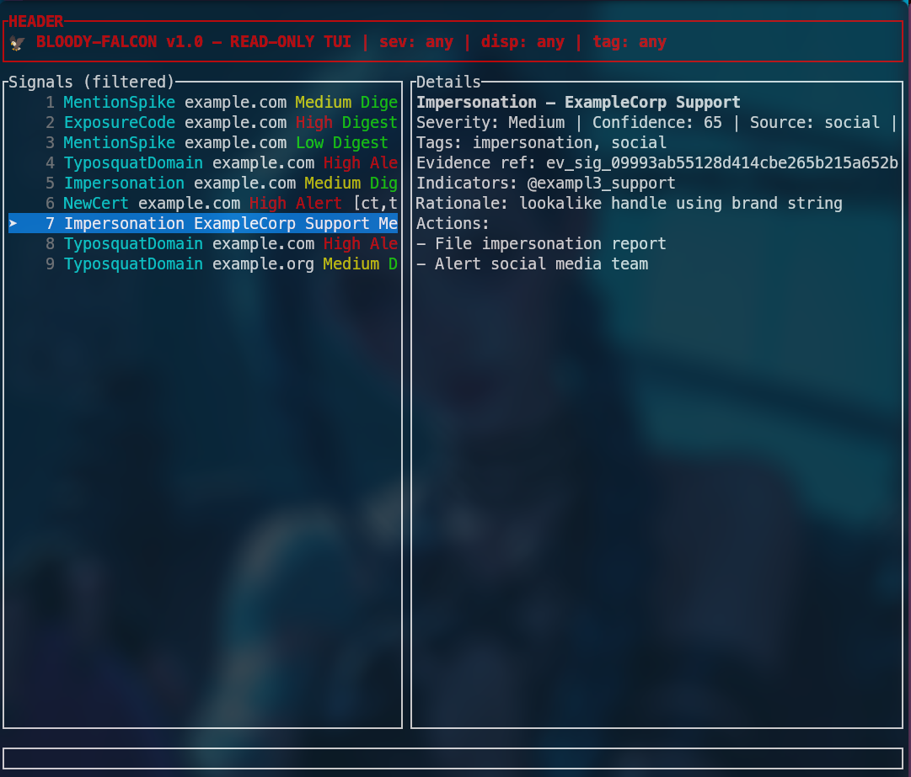
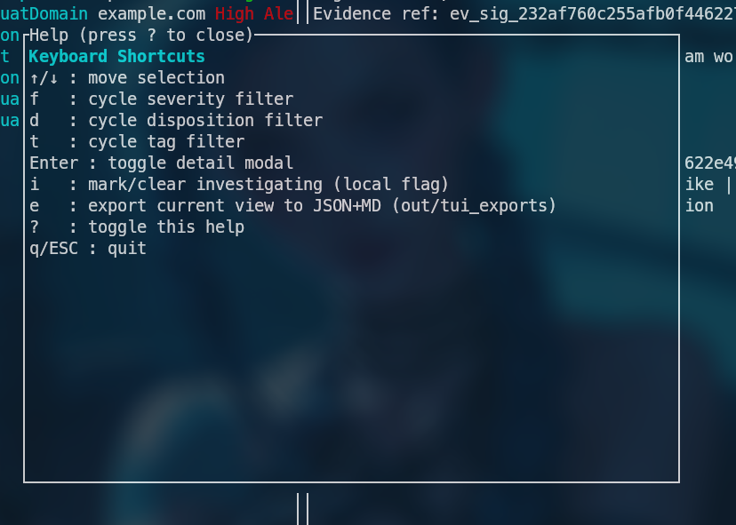

# BloodyFalcon

Defensive OSINT radar for authorized client monitoring. BloodyFalcon turns scoped, public signals into normalized findings with deterministic IDs, auditable evidence, and explainable decisions. It does not scan, exploit, or bypass protections.

## What BloodyFalcon Is
- A scope‑enforced, SOC‑grade pipeline for early warning signals (typosquats, impersonation indicators, new certs, mention spikes, exposure indicators).
- Deterministic and auditable: stable IDs, evidence JSONL, and run manifests with hashes.
- Designed to minimize false positives via suppression rules, corroboration requirements, and policy gates.

## What It Is Not
- Not a vulnerability scanner or exploitation tool.
- Not a scraping platform for personal data.
- Not a bypass or intrusion framework.

## Scope & Safety Guarantees
- **Scope is mandatory**: refuses to run without `--scope` unless `--demo-safe`.
- **Demo-safe**: only offline fixtures are allowed.
- **Privacy-first**: redaction enforced unless explicitly allowed.
- **Low noise**: generic-token suppression, negative keyword filtering, and temporal decay.

## Determinism & Auditability
- **Stable IDs**: derived from signal type, subject, evidence, and indicators.
- **Evidence JSONL**: one record per line; deterministic ordering.
- **Run manifest**: includes scope/config hashes, detector list, and evidence/output hashes.

## Quick Start
```bash
# Scan using a scoped client file
bloodyfalcon scan --scope clients/example.toml --format jsonl --output out/

# Replay fixtures (offline, deterministic)
bloodyfalcon replay --scope clients/example.toml --fixture fixtures/run-2025-01-02.jsonl --output out/

# Generate a report from the latest run
bloodyfalcon report --scope clients/example.toml --format markdown --output out/report.md

# Trend intelligence (no network required)
bloodyfalcon trend --scope clients/example.toml --window 7d --format markdown --output out/trend.md

# Demo-safe mode (no scope required)
bloodyfalcon scan --demo-safe --format jsonl --output out/
```

## Example Sanitized Output (JSONL)
```json
{"id":"sig_...","signal_type":"TyposquatDomain","subject":"example.com","source":"typosquat","evidence_ref":"ev_...","timestamp":"2025-01-02T00:00:00Z","indicators":["example.org"],"confidence":60,"severity":"Medium","rationale":"...","recommended_actions":["Review domain"],"dedupe_key":"TyposquatDomain:example.com:example.org","suppression_reason":"generic-token typosquat without corroboration","policy_flags":["suppressed:generic_token"]}
```

## Trend Examples
JSON (trend report):
```json
{
  "window_start": "2025-01-01T00:00:00Z",
  "window_end": "2025-01-08T00:00:00Z",
  "summary": [
    "3 new TyposquatDomain signals in the last 7 days."
  ],
  "by_signal_type": [
    {
      "key": "TyposquatDomain",
      "count": 3,
      "prev_count": 0,
      "delta": 3,
      "first_seen": "2025-01-02T00:00:00Z",
      "last_seen": "2025-01-04T00:00:00Z",
      "first_seen_in_window": true
    }
  ]
}
```

CSV (trend report):
```csv
dimension,key,count,prev_count,delta,first_seen,last_seen,first_seen_in_window
signal_type,TyposquatDomain,3,0,3,2025-01-02T00:00:00Z,2025-01-04T00:00:00Z,true
```

## Screenshots (TUI read-only viewer)
- Signal list with filters (severity/disposition/tag) and status line:
  
  

- Detail modal with explainability, suppression reasons, and linked findings:

  

## Alert Explainability Demo
Use the alert fixture to see a full “Why this alert fired” section in the Markdown report:
```bash
bloodyfalcon replay --scope clients/example.toml --fixture fixtures/run-alert-2025-01-02.jsonl --output out_alert/
bloodyfalcon report --scope clients/example.toml --format markdown --output out_alert/report.md
```
The report will include rule traces, confidence adjustments, and corroborating signals for the alert.

## How SOCs Should Use It
1. Run scheduled scans with a client scope file.
2. Review alerts first; Investigate and Digest findings follow.
3. Use trend reports to track drift and new activity.
4. Preserve manifests and evidence for audit trails.

## Security Philosophy
BloodyFalcon prefers silence over false certainty. When it speaks, it is precise, explainable, and defensible.

## Release Hygiene
- **Real client scope files must never be committed.** Use `clients/example.toml` as a template.
- Outputs, logs, and databases are ignored by default in `.gitignore`.

## Development
```bash
cargo fmt
cargo test
```
